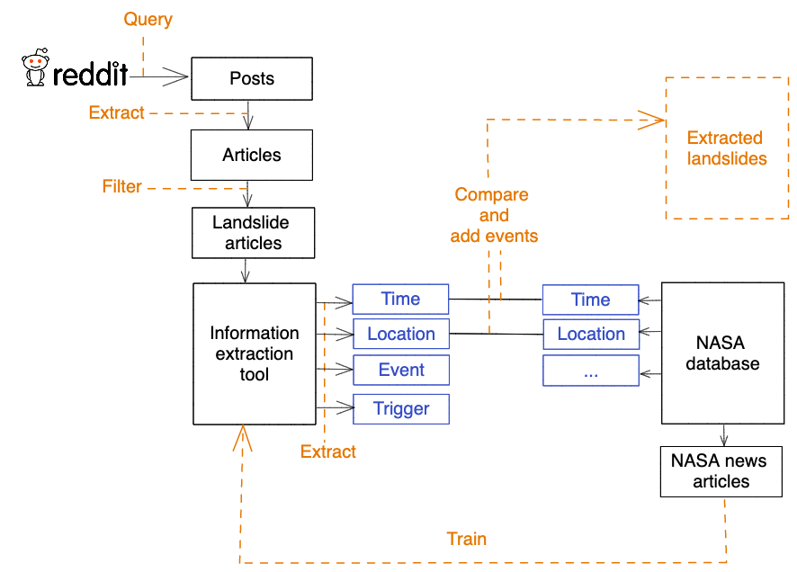
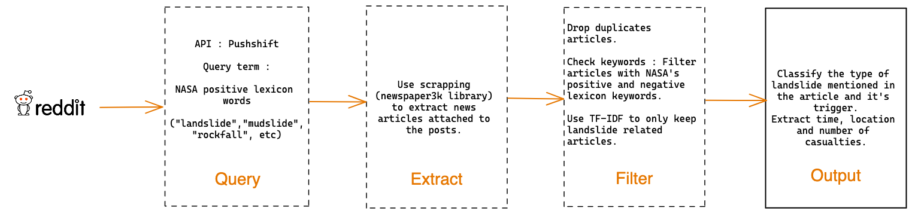
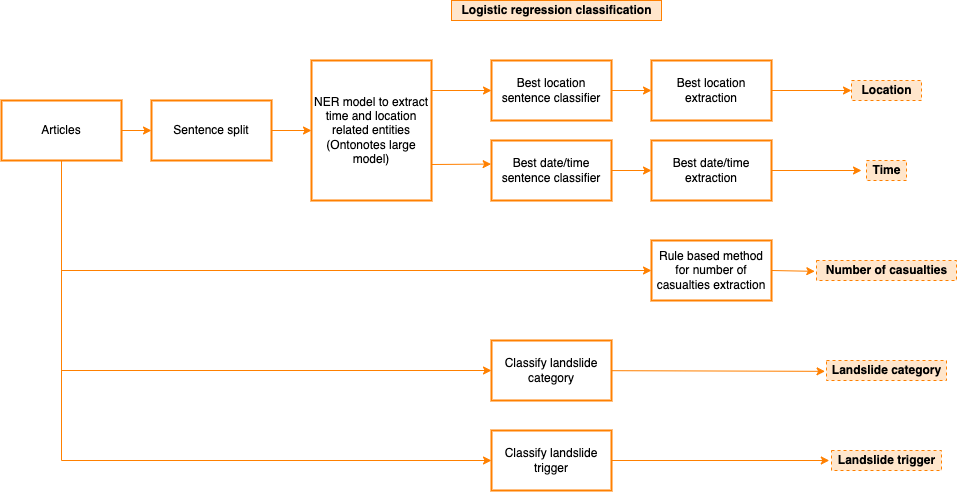
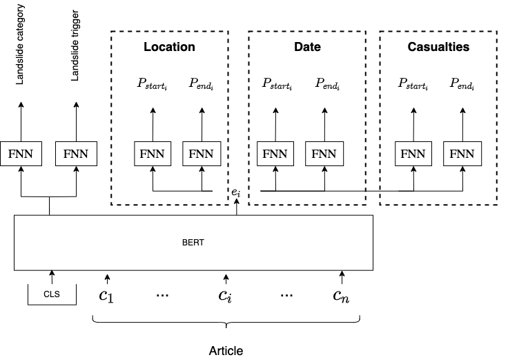
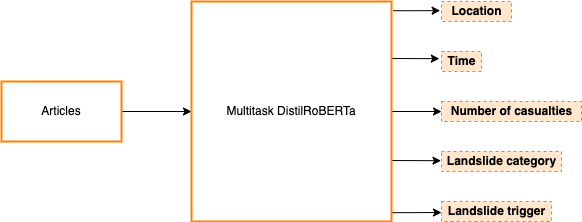

# BGC-NASA-landslide-detection

The goal of this project is to expand NASA's [Cooperative Open Online Landslide Repository (COOLR)](https://maps.nccs.nasa.gov/arcgis/apps/MapAndAppGallery/index.html?appid=574f26408683485799d02e857e5d9521) by automatically extracting landslide events from online sources.

## Architecture

This is an overview of the project on how landslides are extracted from Reddit:




News articles are first extracted from online sources and then passed to a model that extracted the landlside's event properties.


For Reddit specifically, the data extraction pipeline looks like this:




### Models

Models are needed to extract information from the articles : `time`, `location`, `casualties`, `landslide category` and `landslide trigger`.

#### Baseline

The baseline is a straightforward implementation of the extraction process and combines an NER model ([`ontonotes-large`](https://huggingface.co/flair/ner-english-ontonotes-large)), linear models and in some cases post processing to extract the most likely event properties:




#### Multitask

A more complex implementation of the extraction process, uses span based extraction to extract all the event properties:



The model is used to extract the event information directly:



## Project Structure

```
├── data
├── diagrams
├── docs
├── models
├── notebooks
│   ├── Time\ notebook.ipynb
│   ├── article_detection.ipynb
│   ├── data_preprocessing.ipynb
│   ├── location_extraction.ipynb
│   ├── location_pipeline.ipynb
│   ├── multi-task-dataset-squad.ipynb
│   ├── multi-task-dataset.ipynb
│   └── multi-task-learning-QA-squad-data.ipynb
├── requirements.txt
├── setup.py
├── src
│   ├── config.py
│   ├── data
│   │   ├── articles.py
│   │   ├── data.py
│   │   ├── downloader
│   │   │   └── reddit.py
│   │   └── duplicates.py
│   ├── extraction
│   │   ├── casualties
│   │   │   └── casualties.py
│   │   ├── location
│   │   │   ├── landslide_event_location.py
│   │   │   └── location.py
│   │   └── time
│   │       ├── helpers.py
│   │       ├── landslide_event_time.py
│   │       └── time.py
│   ├── main.py
│   └── models
│       ├── baseline
│       │   ├── baseline.py
│       │   └── ner.py
│       └── multitask
│           └── multitask.py
└── user
    ├── baseline_results.csv
    ├── multitask_results.csv
    ├── config.json
    ├── history.log
    └── run.log
```

## Config file

The config file can be configured to extract articles from a certain time interval and extract information from them with the chosen model.

- __default__ : if set to `"yes"`, will read the `history.log` file and download the articles from the latest date recorded in the file to the current date. At each run, the program will record the download dates, which means if __default__ is left to `"yes"`, the program will always download new articles starting from the latest date.
- __now__ : if set to `"yes"` will ingore the end date and end at the current date.

## Docker

1. Install [Docker](https://docs.docker.com/get-docker/).
2. Download landslides.tar and user files from this [link](https://drive.google.com/drive/folders/1jpARrfLu9sGGVa9YCxBKmeEF0UJtMrMk) to your local directory.
3. You can choose model and start/end date by editing the config file.
4. Go to the directory where you saved the `landslides.tar` in the terminal.
5. Type and run `docker load < landslides.tar` in  terminal
   The terminal should show `Loaded image: landslides:latest`.
6. Type and run `docker run -v $(pwd)/user:/user landslides` in terminal.
7. You can see the final results in the user folder.

Thanks!!
